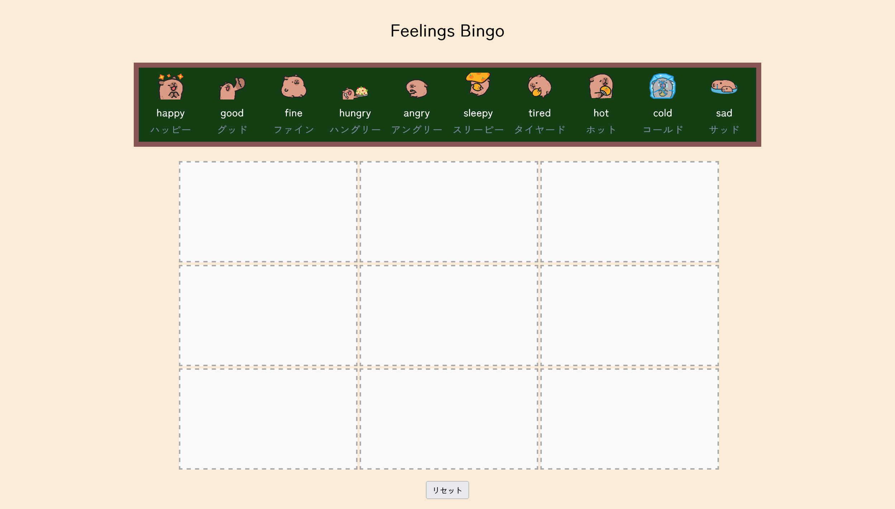
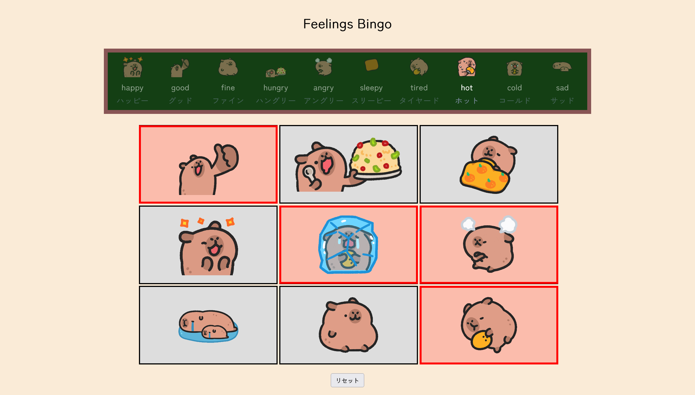

# Feelings Bingo 😁

Feelings Bingo is a simple, interactive web app for exploring and expressing emotions. Drag and drop feelings onto a bingo board, then lock your choices and play!

## Features

- **Drag and drop:** Move feelings from the bank onto the bingo board.
- **Lock board:** Finalize your board to start playing.
- **Reset:** Clear the board and start over.
- **Visuals:** Each feeling has a fun animated image and Japanese translation.

## Screenshots

## How to Use

1. **Drag** a feeling from the top bank and **drop** it onto any empty cell on the bingo board.
2. Fill all 9 cells with different feelings.
3. Click **決定** (Lock) to finalize your board.
4. Click on cells to mark them as checked during play.
5. Use **リセット** (Reset) to clear the board and start again.

#### Enjoy playing feelings bingo!