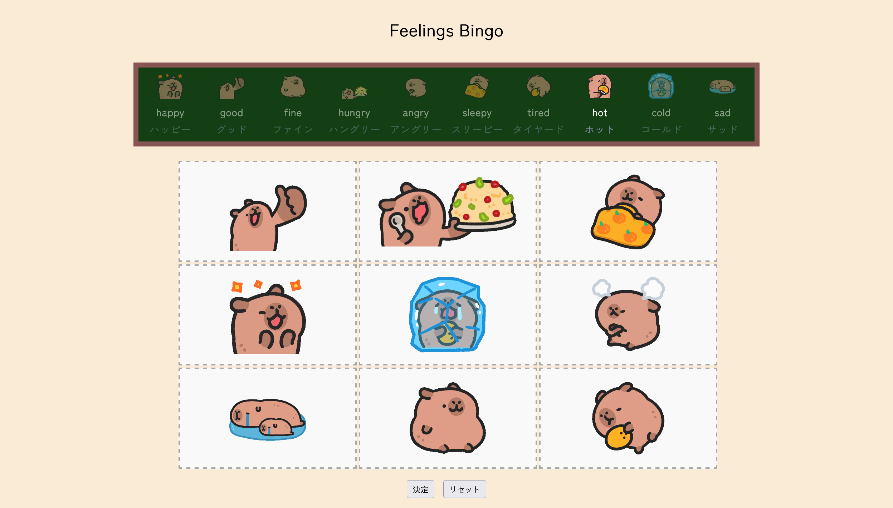

# Feelings Bingo 👋

Feelings Bingo is a simple, interactive web app for practicing and expressing emotions. Drag and drop feelings onto a bingo board, then lock your choices and play!

## Features

- **Drag and drop:** Move feelings from the blackboard onto the bingo board.
- **Lock board:** Finalize your board to start playing.
- **Reset:** Clear the board to start over and play again.
- **Visuals:** Each feeling has a fun animated image and Japanese translation.
- **Worksheet:** Included is a PDF worksheet if your class prefers to work offline.

## Screenshots

## How to Play

1. **Drag** a feeling from the top bank and **drop** it onto any empty cell on the bingo board.
2. Fill all 9 cells with different feelings.
3. Click **決定** (Lock) to finalize your board.
4. Click on cells to mark them as checked during play.
5. Use **リセット** (Reset) to clear the board and start again.

### Enjoy playing feelings bingo! 🎉
